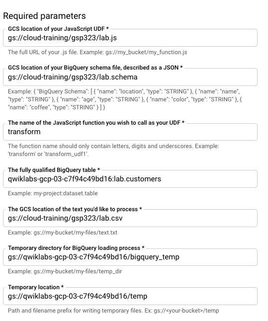
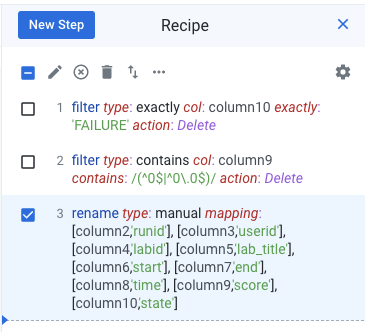

# Dataflow Job
* Set the zone by using command

      gcloud config set compute/zone us-central1-a
* create **Bigquery Dataset** using command

      bq mk lab

* Create Environment Variable **Project ID**

      YOUR_PROJECT=$(gcloud config get-value core/project)
* Create Bucket Storage

      gsutil mb gs://$YOUR_PROJECT
* Create job by batch template **Text Files on Cloud Storage to BigQuery** under **Process Data in Bulk (batch)**
  
  As shown in image
    

* **Submit & Run the Job**

# Dataproc Job
* Set **Region**

      gcloud config set dataproc/region us-central1
* Create **Dataproc Cluster**
      
      gcloud dataproc clusters create example-cluster
* **SSH** into Dataproc Cluster

      gcloud compute ssh example-cluster-m --zone=us-central1-a
* Get **data.txt** file inside Cluster

      hdfs dfs -cp gs://cloud-training/gsp323/data.txt /data.txt

* Exit from SSH
* Submit the **Spark Dataproc Job**

      gcloud dataproc jobs submit spark --cluster example-cluster \
        --class org.apache.spark.examples.SparkPageRank \
        --jars file:///usr/lib/spark/examples/jars/spark-examples.jar -- /data.txt

# Dataprep Job
* **Initialize Dataprep**

* **Create flow**

* **Import** `gs://cloud-training/gsp323/runs.csv`

* Create a **Recipe**

* Add the following Steps

    
* **Run the Job**

# AI

* Execute The Following Commands

      gcloud iam service-accounts create my-natlang-sa \
        --display-name "my natural language service account"

      gcloud iam service-accounts keys create ~/key.json \
        --iam-account my-natlang-sa@${YOUR_PROJECT}.iam.gserviceaccount.com

      export GOOGLE_APPLICATION_CREDENTIALS="/home/USER/key.json"

      gcloud ml language analyze-entities --content="Old Norse texts portray Odin as one-eyed and long-bearded, frequently wielding a spear named Gungnir and wearing a cloak and a broad hat." > result

      gsutil cp result.json gs://$YOUR_PROJECT-marking/task4-cnl.result